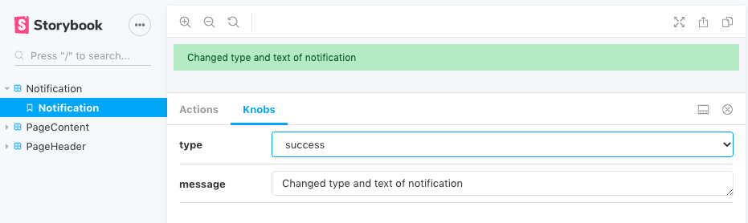

# Storybook

This part of the tutorial adds [Storybook](https://storybook.js.org/) to the React Demo project.

Storybook is a user interface development environment and playground for UI components. The tool runs independentley of the application server to allow users to develop UI components in isolation.

Install dependencies:
```bash
npm install @storybook/cli -g
npm install @storybook/cli @storybook/react @storybook/addons @storybook/addon-actions @storybook/addon-knobs @storybook/addon-notes --save-dev
```

Initialise storybook:
```bash
sb init -f
```

Storybook cli should create the following directories:
* `.storybook`
* `stories`


## Configuration

All Storybook configuration resides in the `.storybook` directory. The default location for component stories is `stories`; Creating stories within the component folder can make it is easier to manage. Storybook webpack configuration can be updated to support additional build requirements such as Sass imports in js.

Update `.storybook/main.js`:
```js
module.exports = {
  // Change the default stories directory to the component directories
  stories: ['../src/**/**/*.stories.jsx'],
  // Configure Storybook addons
  addons: [
      // Add feature to display data received by event handlers in Storybook
      '@storybook/addon-actions',
      // Add feature to create links that navigate between stories in Storybook
      '@storybook/addon-links',
      // Add feature to edit props dynamically using the Storybook UI
      '@storybook/addon-knobs/register'
  ],
  // Edit Storybooks webpack configuration to support
  webpackFinal: async config => {
    // Add support for Sass imports in js
    config.module.rules.push({
      test: /\.scss$/,
      use: [
        { loader: 'style-loader' }, // Creates the javascript to inject CSS into the DOM
        { loader: 'css-loader' },   // Interprets @import/url() as import/require() within the js and resolves them
        { loader: 'sass-loader' }   // Loads a Sass/SCSS file and compiles it to CSS.
      ]
    });

    return config;
};
```

Create `.storybook/preview.js`:
```js
import { addDecorator } from '@storybook/react';
import { withKnobs } from '@storybook/addon-knobs';
import '../src/components/App/App.scss'; // Import global styles

// Use the addons/knobs decorator to allow properties of components to be updated with forms within Storybook
addDecorator(withKnobs);
```

Add the following script entry to `package.json`:
```json
{
    ...
    "scripts": {
        "storybook": "start-storybook -p 4060"
    },
    ...
}
```

## Stories

Each component will have one or more stories for each permutation. For example, a button may have a story for each of the following states:
* Default
* Active
* Hover

Add stories to the components.

Create `src/components/PageHeader/PageHeader.stories.jsx`:
```js
import React from 'react';
import { text } from '@storybook/addon-knobs';
import PageHeader from '.';

export default {
    title: 'PageHeader',
    component: PageHeader,
    parameters: {
        componentSubtitle: 'Used to display page heading',
        notes: 'page header heading h1'
    }
};

// Use the text knob to define a text input for updating the page header within Storybook
export const pageHeader = () => (
    <PageHeader
        heading={text('Heading', 'Example Page Heading')}
    />
);
```

Create `src/components/PageContent/PageContent.stories.jsx`:
```js
import React from 'react';
import { text } from '@storybook/addon-knobs';
import PageContent from '.';

export default {
    title: 'PageContent',
    component: PageContent,
    parameters: {
        componentSubtitle: 'Used to display page content',
        notes: 'page content'
    }
};

// Use the text knob to define a text input for updating the page content within Storybook
export const pageContent = () => (
    <PageContent>
        <p>{text('Content', 'Example page content...')}</p>
    </PageContent>
);
```

Create `src/components/Notification/Notification.stories.jsx`:
```js
import React from 'react';
import { text, select } from '@storybook/addon-knobs';
import config from '../../config';
import Notification from '.';

export default {
    title: 'Notification',
    component: Notification,
    parameters: {
        componentSubtitle: 'Used to display a notification',
        notes: 'notification error success info warning'
    }
};

// Use the text knob to define a text input for updating the notification message within Storybook
// Use the select knob to define a select box for changing the notification type within Storybook
export const notification = () => (
    <Notification
        type={select('Type', config.notification.types, '-')}
        message={text('Message', 'Example notification message...')}
    />
);
```

Run storybook:
```bash
npm run storybook
```

Validate Storybook is automatically opened in the browser.

Experiment using the knobs to change te components appearance:



#### [&#8592; Previous: Components](./5-components.md) | [Next: Context &#8594;](./7-context.md)


## Resources

https://storybook.js.org/

https://www.learnstorybook.com/intro-to-storybook/react/en/simple-component/

https://medium.com/@regalius/how-to-better-manage-your-react-components-with-storybook-c6b06abe71e9

https://storybook.js.org/docs/guides/quick-start-guide/

https://storybook.js.org/docs/addons/using-addons/

https://www.npmjs.com/package/@storybook/addon-actions

https://www.npmjs.com/package/@storybook/addon-links

https://www.npmjs.com/package/@storybook/addon-knobs
